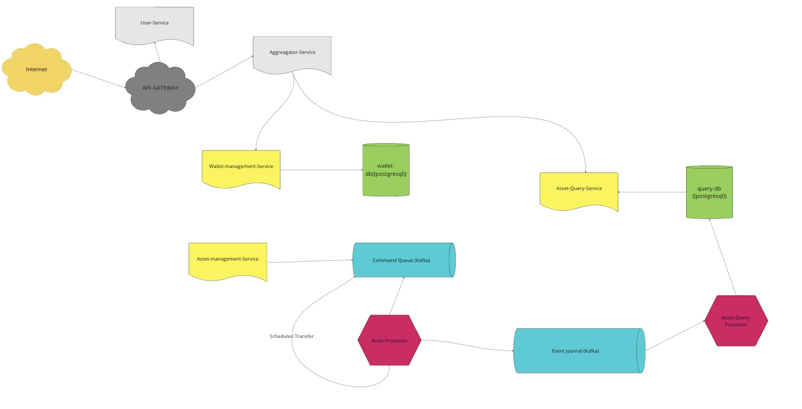

# go cqrs event sourcing / clean architecture based (tahassurtalih)


- Don’t reinvent the wheel.

- Polymorphism gives you the ability to create one module calling another and yet have the compile time dependency point against the flow of control instead of with the flow of control.
you have absolute control over your depedency structure you can avoid wiriting fragile rigid and non reusable modules.  (Robert C. Martin)

- the dependencies oppose the flow of control. this inversion of depedencies prevents the system from rotting because it stops the fan out of the copy module from growing. the copy module doesn't need to be modified because all of its outgoing depedencies terminate at the file abstracation ,new devices can be added ad nauseam without affecting the copy program one little bit.  (Robert C. Martin)

- high level modules should not depend upon low level modules. Both should depend upon abstractions.

- This project is developed based on the https://github.com/evrone/go-clean-template repository and was selected from among other repositories in the starred list for further development.


# What was paid attention to ?

Evrone repository rules: [https://github.com/evrone/go-clean-template?tab=readme-ov-file#the-main-principle](https://github.com/evrone/go-clean-template?tab=readme-ov-file#the-main-principle)

**The inner layer** with business logic should be clean. It should:

- Not have package imports from the outer layer.
- Use only the capabilities of the standard library.
- Make calls to the outer layer through the interface (!).

The business logic doesn't know anything about Postgres or a specific web API. Business logic has an interface for working with an _abstract_ database or _abstract_ web API.

**The outer layer** has other limitations:

- All components of this layer are unaware of each other's existence. How to call another from one tool? Not directly, only through the inner layer of business logic.
- All calls to the inner layer are made through the interface (!).
- Data is transferred in a format that is convenient for business logic (`internal/entity`).

For example, you need to access the database from HTTP (controller). Both HTTP and database are in the outer layer, which means they know nothing about each other. The communication between them is carried out through `usecase` (business logic):


## Content

- [Holistic overview](#Holistic-overview)
- [Projects general architecture](#Project-general-architecture)
- [Cheat Sheet](#cheat-sheet)
- [Quick start](#quick-start)
- [Local Debugging Cheat Sheet](#local-debugging-cheat-sheet)
- [Postgresql monitoring](#Postgresql-monitoring)
- [Kakfa monitoring](#Kafka-monitoring)
- [Start over from the beginning](#Start-over-from-the-beginning)
- [docker helper commands](#docker-helper-commands)
- [missing parts](#missing-parts)


## Holistic Overview

The project named go-cqrs-event-sourcing-tt implements a CQRS (Command Query Responsibility Segregation) architecture with the following components:

### Wallet-Management-Service:
	•	A RESTful API microservice.
	•	Responsible for creating, deleting, and updating wallet information.
	•	Uses a PostgreSQL database to store wallet records.
### Asset-Management-Service:
	•	Another RESTful API microservice.
	•	Handles operations like deposit, withdraw, and transfer.
	•	Publishes commands to a Kafka command queue.
### Asset-Processor:
	•	Listens to commands from the Kafka command queue.
	•	Validates and processes the commands, then writes events to a Kafka event journal.
	•	Manages scheduled transfers by either rescheduling them or generating the appropriate events when the time comes.
### Asset-Query-Processor:
	•	Consumes events from the Kafka event journal.
	•	Updates a query database, which is implemented in PostgreSQL but can also use MongoDB.
### Asset-Query-Service:
	•	A RESTful API microservice.
	•	Serves data retrieved from the query database to external clients.

This architecture ensures a clear separation of concerns, scalability, and maintainability in a distributed, event-driven environment.





## Project General architecture

### Main Entry Point
#### cmd/app/main.go

    •	The entry point of the application.
    •	This file defines the starting flow of the program.

### Configuration
#### config/

    •	Contains configuration files for the application.
    •	Examples: database connections, environment variables, API keys.

### Documentation
### docs
    •	Stores Swagger documentation files and other technical documentation.
    •	Use the swag init command to update Swagger documentation here.

### Application Logic
### internal/app

    •	Contains the Run function of the program.
    •	Manages the initialization of components, such as the HTTP server and database connections.

#### Controller Layer (Outer Layer)
### internal/controller/http 

    •	Handles the REST API layer.
    •	Built using the Gin Framework, defining HTTP endpoints.
    •	Responsible for REST versioning.
    •	Entry point for generating Swagger documentation (swag init should point to this folder).
    •	Customizated kafka producer and kafka consumer 
    


#### Business Logic Layer (Inner Layer)
### internal/usecase/
    •	Contains the core business logic of the application.
    •	Called by the controller layer to execute specific use cases.


#### Repository Layer (Inner Layer)
### internal/repo/

    •	Manages all database-related operations (CRUD).
    •	Isolates database logic from the rest of the application.

#### Web API Layer (Inner Layer)
### internal/webapi/ (inner layer)

    •	Handles interactions with external APIs.
    •	Example: Sending messages using third-party API calls.

#### Entity Layer (Inner Layer)
### internal/entity/ (inner layer)

    •	Defines the entities used in the business logic.
    •	These entities are shared and accessible across all layers.

#### Reusable Packages
### pkg/ 
    •	Contains reusable packages and modules.
    •	Any package here can be imported and used by anyone who imports the module.


## Quick Start

```sh
# Start all services and dependencies (e.g., PostgreSQL, Kafka, application)
$ make compose-up

# Open Kafdrop (Kafka monitoring UI) in your browser
$ http://localhost:9000/

# Access and verify the wallet management database
$ make login-wallet-db

# Access and verify the query database
$ make login-query-db

# Create sample wallets
$ make create-wallets

# Perform deposit operations on wallets
$ make deposit-wallets

# Perform a withdrawal operation on a wallet
$ make withdraw-wallet

```

## Cheat Sheet

```sh

# to decode messages.
$ echo "eyJldmVudF9pZCI6ImMwYjBiNTRhLTZjNDktNDg0OC05YjZhLTE0MTM1NjQwNTZjMSIsIndhbGxldF9pZCI6MSwiYXNzZXRfbmFtZSI6IkJUQyIsInR5cGUiOiJkZXBvc2l0IiwiYW1vdW50IjoxMDAsInRpbWVzdGFtcCI6MTczODQ5MjkxNH0=" | base64 --decode

# 
$ docker exec -it kafka bash

# Unix Epoch Time formatında, yani 1970-01-01 00:00:00 UTC tarihinden itibaren geçen saniye sayısını temsil eder.
$ date -r 1738492914


# 
$ netstat -tuln

```


## Local Debugging Cheat Sheet

You can debug the application locally using Visual Studio Code. Here’s an example launch.json configuration:
```sh
{
    "version": "0.2.0",
    "configurations": [
        {
            "name": "Debug API",
            "type": "go",
            "request": "launch",
            "mode": "debug",
          /* "program": "${workspaceFolder}/wallet-management-service/cmd/app",// The main directory of the application
            "cwd": "${workspaceFolder}/wallet-management-service",  */
           /* "program": "${workspaceFolder}/wallet-management-service/cmd/app",// The main directory of the application
            "cwd": "${workspaceFolder}/wallet-management-service", */
           /* "program": "${workspaceFolder}/asset-query-processor/cmd/app",// The main directory of the application
            "cwd": "${workspaceFolder}/asset-query-processor", */
            "program": "${workspaceFolder}/asset-processor/cmd/app",// The main directory of the application
            "cwd": "${workspaceFolder}/asset-processor",
            "env": {
                "GIN_MODE": "debug"// Environment variables
              //  "CONFIG_PATH": "./config/config.yml"
            },
            "args": [] // Add any arguments required for your API to run here
        }
    ]
}
```


## Postgresql monitoring

To see what is happening in the database:

```sh
# # Access the PostgreSQL database as the specified user and database.
$ docker exec -it postgres psql -U user -d postgres

# List tables:
$ \dt

# View the structure of a specific table:
$ \d messages

# Retrieve all data from the table:
$ select * from messages;

# Exit the psql interface:
$ \q 
```


## Kafka monitoring

To monitor Kafka activity, you can use Kafdrop.
```sh
If you run docker compose-up, Kafdrop will be available at http://localhost:9000/.
```


## Start over from the beginning

For the fresh start you can track these steps:

```sh
# # Stop and remove all containers
$ make compose-down

# Remove Docker volumes (if you prefer to keep database changes, skip this step)
$ make remove-volumes

# ## Remove unused Docker images, excluding project images
$ make clean-docker-images

# Resolve port conflicts (e.g., port 8080 in use)
$ lsof -i :8080
# COMMAND     PID      USER   FD   TYPE             DEVICE SIZE/OFF NODE NAME
# app       42073 ozlemugur    9u  IPv6 0x9be0dbb3dbb48eb7      0t0  TCP *:http-alt (LISTEN)
# Arc\x20He 82052 ozlemugur   34u  IPv6  0xf726809424a9b2f      0t0  TCP localhost:49923->localhost:http-alt (CLOSED)
$ kill -9 42073
```


## docker helper commands


```sh
# Volume management:
$ docker volume ls  
$ docker volume ls -f dangling=true
$ docker volume rm "volumename"
$ docker volume inspect "volumename"
```

```sh
# Container management:
$ docker ps
$ docker ps -a 
$ docker rm "containerid"
$ docker start/stop "containerid"
$ docker images
$ docker rmi "imageid"
$ docker exec -it postgres psql -U user -d postgres
$ docker logs -tail=all <containerid>
```


## Missing features

	•	Balance checks can be performed via an HTTP call to the Asset-Query-Service. Alternatively, the Asset-Processor can maintain balance control before sending events to the event journal. It is also possible for the Asset-Processor to directly access the query database. However, it is crucial to aim for loosely coupled services whenever possible.
	•	For transfer operations, it would be logical to reserve a specific balance for pending transactions.
	•	Information about which network supports which asset, along with validation rules, should be added.
	•	An Authentication Middleware should be implemented.
	•	Enhancements related to retry logic and a Dead Letter Queue should be completed.
	•	I aimed to make the Event Journal the source of truth. However, with the introduction of scheduled transactions, handling them initially in the Command Queue proved more logical. Therefore, the Asset-Processor needs robust validation mechanisms.
	•	I did not maintain a separate store for data sent to the Command Queue. It might be beneficial to persist these commands separately to help ensure data consistency and integrity.


#### we should add these features


#### Useful links
- [The Clean Architecture article](https://blog.cleancoder.com/uncle-bob/2012/08/13/the-clean-architecture.html)
- [Twelve factors](https://12factor.net/)

## the fin

  


######   stack Trace

asset-query-processor  kafka göçtüğünden kapanıyor, handle mı etsek anacım

retry mechanism için ayrı efor gerekecek, ayrıca konuşalıms.

kafdrop is serve here:  http://localhost:9000/

kafdrop message decode

echo "eyJldmVudF9pZCI6ImMwYjBiNTRhLTZjNDktNDg0OC05YjZhLTE0MTM1NjQwNTZjMSIsIndhbGxldF9pZCI6MSwiYXNzZXRfbmFtZSI6IkJUQyIsInR5cGUiOiJkZXBvc2l0IiwiYW1vdW50IjoxMDAsInRpbWVzdGFtcCI6MTczODQ5MjkxNH0=" | base64 --decode


echo "eyJjb21tYW5kX2lkIjoiYzc2NmYzNjAtN2IzNS00OWFkLTgwNmItZTQwOGZmMGRhNzg5IiwiZnJvbV93YWxsZXQiOjEsInRvX3dhbGxldCI6MiwiYXNzZXRfbmFtZSI6IkJUQyIsImFtb3VudCI6NSwiZXhlY3V0ZV90aW1lIjoxNzM4NTMwMjcxLCJzdGF0dXMiOiJzY2hlZHVsZWQiLCJjcmVhdGVkX2F0IjoiMjAyNS0wMi0wMlQyMzowNjo0NS4wMDUyNTk2NzkrMDM6MDAifQ==" | base64 --decode

{"event_id":"c0b0b54a-6c49-4848-9b6a-1413564056c1","wallet_id":1,"asset_name":"BTC","type":"deposit","amount":100,"timestamp":1738492914}%   

************************************************

date -r 1738492914

Unix Epoch Time formatında, yani 1970-01-01 00:00:00 UTC tarihinden itibaren geçen saniye sayısını temsil eder.

************************************************

netstat -tuln


docker exec -it kafka bash
kafka-console-consumer --bootstrap-server localhost:9092 --topic event-journal --from-beginning


wallet management service sadece crud operasyonları için kullanılsın. (kendine özel postgresqli olacak, sadece bu işlemler için. created, updated, delete işlemleri için ayrıca diğer dblerle diyalog kurulabilir ama en sona koyabilirisn.)
assetmanageemnt service (command api olsun)- event journala yazacak olan api bu olacak, withdraw, deposit vs hepsi burada olacak. 
asset - querry service (query api olsun, kendine özel postgresqli read model olacak)


go: finding module for package github.com/ozlemugur/go-cqrs-event-sourcing-tt/asset-management-service/docs
go: finding module for package github.com/ozlemugur/go-cqrs-event-sourcing-tt/internal/entity
go: github.com/ozlemugur/go-cqrs-event-sourcing-tt/asset-management-service/internal/controller/http/v1 imports
        github.com/ozlemugur/go-cqrs-event-sourcing-tt/asset-management-service/docs: no matching versions for query "latest"
go: github.com/ozlemugur/go-cqrs-event-sourcing-tt/asset-management-service/internal/usecase/repo imports
        github.com/ozlemugur/go-cqrs-event-sourcing-tt/internal/entity: no matching versions for query "latest"


[Error - 6:45:21 PM] Request textDocument/hover failed.
  Message: no package data for import "github.com/ozlemugur/go-cqrs-event-sourcing-tt/asset-management-service/docs"
  Code: 0 
[Error - 6:45:21 PM] Request textDocument/hover failed.
  Message: no package data for import "github.com/ozlemugur/go-cqrs-event-sourcing-tt/asset-management-service/docs"
  Code: 0 
[Error - 6:45:21 PM] Request textDocument/hover failed.
  Message: no package data for import "github.com/ozlemugur/go-cqrs-event-sourcing-tt/asset-management-service/docs"
  Code: 0 
[Error - 6:45:22 PM] Request textDocument/hover failed.
  Message: no package data for import "github.com/ozlemugur/go-cqrs-event-sourcing-tt/asset-management-service/docs"
  Code: 0 
[Error - 6:45:22 PM] Request textDocument/hover failed.
  Message: no package data for import "github.com/ozlemugur/go-cqrs-event-sourcing-tt/asset-management-service/docs"
  Code: 0 
[Error - 6:45:23 PM] Request textDocument/hover failed.
  Message: no package data for import "github.com/ozlemugur/go-cqrs-event-sourcing-tt/asset-management-service/docs"
  Code: 0 
[Error - 6:45:27 PM] 2025/01/29 18:45:27 command error: err: exit status 1: stderr: go: finding module for package github.com/ozlemugur/go-cqrs-event-sourcing-tt/asset-management-service/docs
go: finding module for package github.com/ozlemugur/go-cqrs-event-sourcing-tt/asset-management-service/docs
no matching versions for query "latest"

 swag init -g asset-management-service/internal/controller/http/v1/router.go -o asset-management-service/docs

 go mod tidy çalışmıyordu.


** konfigurasyonların envden alınmasını ayarla.
** Kraft mode çalışılabilir.


** docker builder prune -f 
** docker system prune -a 
--no-cache kullanımı 

compose-up-app: ##  ddd
	docker-compose build --no-cache asset-query-processor
	docker-compose up  -d asset-query-processor   && docker-compose logs -f
.PHONY: compose-up-app


*** docker build --progress=plain --no-cache -t asset-query-processor .
Bu komut:
	•	--progress=plain: Daha ayrıntılı log verir.
	•	--no-cache: Önceden cache’lenmiş adımları kullanmaz.
	•	-t asset-query-processor: Image’e bir ad verir.
	•	.: Dockerfile’ın bulunduğu dizini işaret eder (mevcut dizin).

*** docker run -it --rm  asset-query-processor sh
*** docker run --platform linux/amd64 -it --rm asset-query-processor sh


git pull --rebase origin main 
Bu komut uzak branch’i kendi branch’inin üzerine taşıyarak commit geçmişini temiz tutar.

git config pull.rebase false  # Merge yöntemi varsayılan olur

git config pull.rebase true   # Rebase yöntemi varsayılan olur

git config --global pull.rebase false


notes:

{
    "version": "0.2.0",
    "configurations": [
        {
            "name": "Debug API",
            "type": "go",
            "request": "launch",
            "mode": "debug",
            "program": "${workspaceFolder}/asset-query-processor/cmd/app",// The main directory of the application
            "cwd": "${workspaceFolder}/asset-query-processor",
            "env": {
                "GIN_MODE": "debug", // Environment variables
                "CONFIG_PATH": "./config/config.yml"
            },
            "args": [] // Add any arguments required for your API to run here
        }
    ]
}


%3|1738428059.880|FAIL|rdkafka#consumer-1| [thrd:kafka:9092/bootstrap]: kafka:9092/bootstrap: Connect to ipv4#172.18.0.4:9092 failed: Connection refused (after 8ms in state CONNECT)

docker network inspect go-cqrs-event-sourcing-tt_custom-network


docker exec -it e48e20783d31 sh

kafka-topics --list --bootstrap-server kafka:9092


ozlemugur@cassandra go-cqrs-event-sourcing-tt % docker exec -it e48e20783d31 sh
sh-4.4$ kafka-topics --list --bootstrap-server kafka:9092
__consumer_offsets
sh-4.4$ kafka-topics --create --bootstrap-server localhost:9092 --topic event_journal --partitions 3 --replication-factor 1
WARNING: Due to limitations in metric names, topics with a period ('.') or underscore ('_') could collide. To avoid issues it is best to use either, but not both.
Created topic event_journal.
sh-4.4$ kafka-topics --create --bootstrap-server localhost:9092 --topic event-journal --partitions 3 --replication-factor 1
Created topic event-journal.
sh-4.4$ kafka-topics --list --bootstrap-server localhost:9092
__consumer_offsets
event-journal
event_journal
sh-4.4$ kafka-topics --delete --bootstrap-server localhost:9092 --topic event_journal
sh-4.4$ kafka-topics --list --bootstrap-server localhost:9092
__consumer_offsets
event-journal


timeout 5 bash -c 'cat < /dev/tcp/kafka/9092'

I'm gonna kill myself:

https://rmoff.net/2020/07/08/learning-golang-some-rough-notes-s02e01-my-first-kafka-go-producer/

https://www.confluent.io/blog/kafka-client-cannot-connect-to-broker-on-aws-on-docker-etc/?_ga=2.22978111.580618518.1738428927-1331267361.1736872468&_gac=1.94810862.1736872468.Cj0KCQiAs5i8BhDmARIsAGE4xHxp7cJDnwjj6fx0moULDU_FyboI4QVgheDN9oljO42ZmQjzsPPLhi4aAnHeEALw_wcB&_gl=1*7tf3yx*_gcl_aw*R0NMLjE3MzY4NzI0NjguQ2owS0NRaUFzNWk4QmhEbUFSSXNBR0U0eEh4cDdjSkRud2pqNmZ4MG1vVUxEVV9GeWJvSTRRVmdoZUROOW9sak80MlptUWp6c1BQTGhpNGFBbkhlRUFMd193Y0I.*_gcl_au*MzYwNjQwMjcyLjE3MzY4NzI0Njg.*_ga*MTMzMTI2NzM2MS4xNzM2ODcyNDY4*_ga_D2D3EGKSGD*MTczODQzNDE3Ni42LjAuMTczODQzNDE3Ni42MC4wLjA.


docker-compose logs --timestamps


docker exec -it 2fd97f3bef73 psql -U wallet_user -d wallet_db


TODOS:

- laest swagger go install github.com/swaggo/swag/cmd/swag@latest

  
